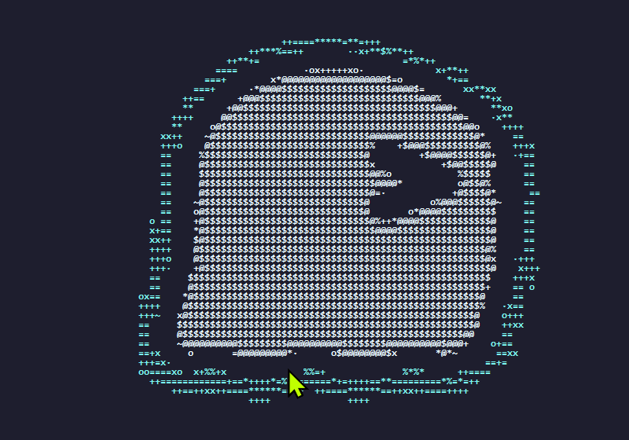
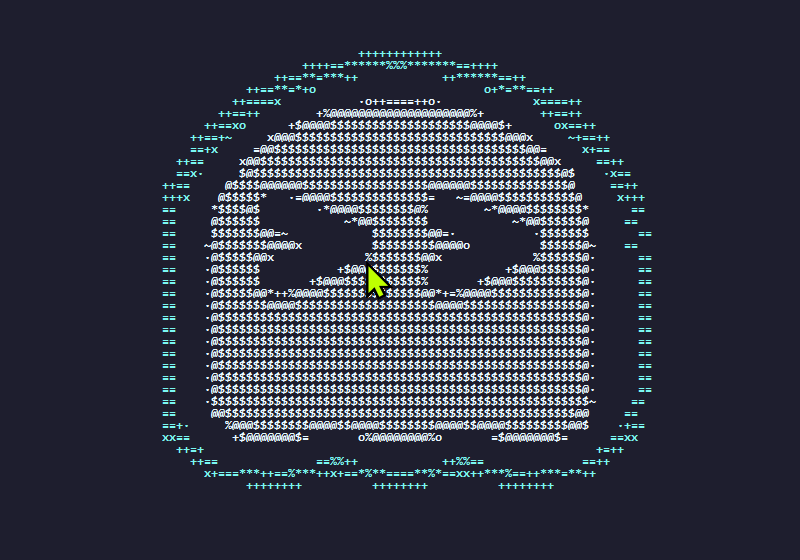
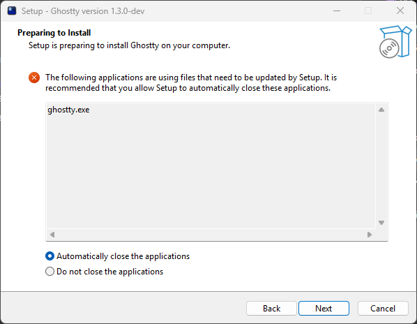

# Ghostty Windows x64 Native Build

Native Windows x64 build of [Ghostty](https://ghostty.org) — no WSL2, no emulation, no compatibility layer.

Built on top of [@adilahmeddev's windows-apprt fork](https://github.com/adilahmeddev/ghostty-windows), which is the most complete Windows port in existence (34,337 lines of Windows-specific code).

> ## ⚠️ Disclaimer — please read
>
> **This is the first program I have ever built.** Zero coding experience, about two weeks into learning to use AI when I made it. It's a passion project / proof-of-concept — "vibe-built" with AI tools (Claude + GitHub Copilot) on top of [@adilahmeddev's fork](https://github.com/adilahmeddev/ghostty-windows), because I wanted a GPU-accelerated terminal on Windows without WSL and wanted to see how far I could push it.
>
> I shared it directly with Ghostty's creator ([@mitchellh](https://github.com/mitchellh)), who appreciated the disclosure. This repo is **not affiliated with or endorsed by** the official Ghostty project.
>
> **It may or may not be maintained.** Anyone is free to build from it, fork it, or take whatever pieces are useful. Issues and PRs are welcome, but I can't promise a response time — this is a PoC that happens to work, not a supported product. If you're comfortable with that, enjoy. If not, that's completely fair.

**System:** Ryzen 7800X3D / RTX 4060 8GB / Windows 11 Pro x64
**Build date:** March 2026
**Status:** Stable for daily use

---

## Screenshots

Startup ghost animation running natively on Win32:

Inno Setup installer (Ghostty 1.3.0-dev):

---

## What Works

- GPU-accelerated rendering (D3D11 primary, OpenGL fallback)
- DirectWrite font backend (native Windows font rendering)
- Multi-window, tabbed, split pane support
- GDI UI overlays (tabs, search bar, command palette)
- Full Win32 API runtime (no GTK, no external frameworks)
- Inno Setup installer

## Known Issues / Feature Gaps

See [FEATURE-GAP.md](FEATURE-GAP.md) for a full breakdown of what's missing vs Linux/macOS builds.

---

## Build Requirements

- **Zig:** 0.15.2 (exact version required)
- **Visual Studio 2022** (for Windows SDK / Win32 headers)
- **Git**
- No MSVC compiler required — Zig bundles its own toolchain

## Build Steps

See [BUILD-LOG.md](BUILD-LOG.md) for the full build process including every issue encountered and how it was resolved.

---

## Pre-built Binary

`bin/ghostty.exe` — run directly or use the installer script in `installer/ghostty.iss` with [Inno Setup](https://jrsoftware.org/isinfo.php).

---

## Notes

This was built with AI assistance as a learning exercise. Not a coder — just stubborn enough to bruteforce it. All findings documented in the build log.

AI breakdown: GitHub Copilot handled the /yolo bruteforce build (throw everything at it until something sticks) — Claude surgically cleaned up the wreckage and figured out why. Turns out that's a pretty effective team.

Upstream fork: https://github.com/adilahmeddev/ghostty-windows
Ghostty: https://ghostty.org
